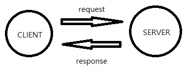

# HTTP-BASIC

this section is talking about structure of http application

## Table of Contents
- [HTTP](#HTTP)
- [URL](#URL)
- [Method](#Method)
- [Header](#Header)
- [Body](#Body)
- [Status](#Status)
- [Examples](#Examples)
- [References](#References)

## HTTP

HTTP ( Hyper Text Transfer Protocol ) is a protocol to request and response between client / server

`e.g., a browser requests the web page then the server returns it`




From the application's point of view :

HTTP request contains fields of `METHOD`, `URL`, `HEADER`, `BODY`

HTTP response contains fields of `STATUS`, `HEADER`, `BODY`

### HTTP Examples
Open the Google Chrome then access http://httpbin.org/get. You may see the following attributes from browser network inspector ( F12 )

- General
  - Remote Address : `54.175.219.8:80`
  - Request Url : `http://httpbin.org/get`
  - Request Method : `GET`
  - Status Code : `200 OK`
- Request Headers
  - Accept : `text/html`
  - Accept-Language : `zh-TW`
  - Host : `httpbin.org`
  - User-Agent : `Chrome/46.0.2490.86`
- Response Headers
  - Content-Length : `620`
  - Content-Type : `application/json`
  - Server : `nginx`

## URL
URL ( Uniform Resource Locator ) is an unique address of a resource on the Internet

### URL Examples
- `http://httpbin.org/get`
- `https://github.com/`
- `http://forum.gamer.com.tw/A.php?bsn=60084`
- `http://192.168.0.1/login.htm`

### URL Parts
For example :  `http://zh.wikipedia.org:80/w/index.php?title=HelloWorld&printable=yes#paragraph1`

field    |  required  | description | example
-----    |  -------   | ----------- | ----
scheme   | O | transfer protocol | http
host     | O | host domain name or ip | zh.wikipedia.org
port     | X | host port | 80
path     | X | path to the resource | /w/index.php
query    | X | additional key-value pairs | ?title=HelloWorld&printable=yes
fragment | X | additional identifier | #paragraph1

### URL Domain Resolving
How does the `zh.wikipedia.org` be resolved ?

How does the agent know where its real address is ?

The answer is **DNS ( Domain Name Server )**

DNS stores key-value pairs of `domain name` and `ip` so that agent can ask DNS to get the real ip address of that host. DNS address would be set in OS network configuration by user or [DHCP](https://en.wikipedia.org/wiki/Dynamic_Host_Configuration_Protocol)

## Method
Client must specify an action when request a resource.
This action indicates the purpose of this request.


### Method Examples
- POST `http://example.com/resources` : create a new resource with body
- GET `http://example.com/resources/1` : get the resource #1
- PUT `http://example.com/resources/1` : update the resource #1 with body
- DELETE `http://example.com/resources/1` : delete the resource #1

### Method List
method   |  idempotent   | description
-----    |  ----------   | -----------
GET      | O | read
POST     | X | create
PUT      | O | create or update
PATCH    | X | update
DELETE   | O | delete
HEAD     | O | read header only

**idempotent** : if an operation returns same result even been executed for multiple times, then this is called idempotent

### Method in Browser
User doesn't see the http method when using browser is that the browser use `GET` when user click link or request any resource by default. The other methods can be triggered by javascript.

## Header
Header contains the extra information of the sender by sender's own.
It is just a key-value pair so that custom header can be used.


### Header Examples
- Client Request
  - Accept : `text/html`
  - Accept-Language : `zh-TW`
  - Host : `httpbin.org`
  - User-Agent : `Chrome/46.0.2490.86`
- Server Response
  - Content-Length : `620`
  - Content-Type : `application/json`
  - Server : `nginx`

### Some Wellknown Headers
header          |  type      | description  | example
-----           |  ------    | -----------  | ------
Host            |  req       | domain name of server | en.wikipedia.org
User-Agent      |  req       | user agent string | Chrome/46.0.2490.86
Accept          |  req       | acceptable content types of response | text/html
Accept-Charset  |  req       | acceptable charset of response | utf-8
Accept-Language |  req       | acceptable human language of response | en-US
Cache-Control   |  req, res  | cache strategy | no-cache
Content-Type    |  req, res  | body MIME type | application/json
Content-Length  |  req, res  | body length in bytes | 348
Server          |  res       | name of server | Apache/2.4.1 (Unix)
Expires         |  res       | response expire date | Thu, 01 Dec 1994 16:00:00 GMT
Last-Modified   |  res       | last modified date of the request target | Tue, 15 Nov 1994 12:45:26 GMT

## Body
Body is an optional message associated with the request or response


### Body Examples
- plain
  ```
  HelloWorld
  ```

- html
  ```html
  <html>
    <head>
      <title>Hi there</title>
    </head>
    <body>
      This is a page
    </body>
  </html>
  ```

- xml
  ```xml
  <response>
    <id>101502549</id>
    <name>Jason Chiu</name>
  </response>
  ```

- json
  ```json
  {
    "response" : {
      "id" : "101502549",
      "name" : "Jason Chiu"
    }
  }
  ```

## Status
Status is a simple code representing the status of the request after processing


### Status Examples
- 200 ( OK )
- 403 ( Forbidden )
- 404 ( Not Found )
- 500 ( Internal Server Error )

### Some Wellknown Statuses
Statuses can be divided into 5 categories :
- 1xx : request continuing process
- 2xx : request success
- 3xx : request will be redirected
- 4xx : client error
- 5xx : server error

#### 2xx
status   | text       | description  
-----    | ---------- | ----------  
200      | ok | request success
201      | created | request success and a new resource is created
204      | no content | request success but returns no content

#### 3xx
status   | text       | description  
-----    | ---------- | ----------  
302      | found | requested resource is moved temporarily and server should response that temporary address
304      | not modified | requested resource is not modified after the specific date if client give that date

#### 4xx
status   | text       | description  
-----    | ---------- | ----------  
400      | bad request | invalid request data
401      | unauthorized | authentication is required and has failed or has not yet been provided
403      | forbidden | server is refusing to respond to it
404      | not found | **current required resource** could not be found
405      | method not allowed | request method not supported by that resource

#### 5xx
status   | text       | description  
-----    | ---------- | ----------  
500      | internal server error | generic server error
502      | bad gateway | server was acting as a gateway or proxy and received an invalid response from the upstream server
503      | service unavailable | server is currently unavailable

## Examples
Open Google Chrome, click **F12** then access http://httpbin.org/ip

You can see the following information in **ip** document in **Network** inspector

- Request
  - Method : `GET`
  - URL : `http://httpbin.org/ip`
  - Headers
      - Accept : `text/html,application/xhtml+xml,application/xml;q=0.9,image/webp,*/*;q=0.8`
      - Accept-Encoding : `gzip, deflate, sdch`
      - Accept-Language : `zh-TW,zh;q=0.8,en-US;q=0.6,en;q=0.4,ja;q=0.2,zh-CN;q=0.2`
      - Connection : `keep-alive`
      - Host : `httpbin.org`
      - User-Agent : `Mozilla/5.0 (Windows NT 10.0; WOW64) AppleWebKit/537.36 (KHTML, like Gecko) Chrome/46.0.2490.86 Safari/537.36`

- Response
  - Status : `200 ( OK )`
  - Headers
      - Access-Control-Allow-Credentials : `true`
      - Access-Control-Allow-Origin : `*`
      - Connection : `keep-alive`
      - Content-Length : `34`
      - Content-Type : `application/json`
      - Server : `nginx`
  - Body
  
    ```json
    {
      "origin": "[ your ip address ]"
    }
    ```


## References

- https://ihower.tw/blog/archives/6483
- https://en.wikipedia.org/wiki/Uniform_Resource_Locator
- https://en.wikipedia.org/wiki/Domain_Name_System
- https://en.wikipedia.org/wiki/List_of_HTTP_header_fields
- https://en.wikipedia.org/wiki/List_of_HTTP_status_codes
