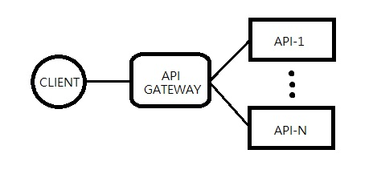

# WEB-SERVICE-PATTERN
this section is talking about architecture patterns of web service

## Table of Contents
- [Web-Service-Architecture-Pattern](#Web-Service-Architecture-Pattern)
- [Monolith](#Monolith)
- [Microservice](#Microservice)
- [References](#References)

## Web-Service-Architecture-Pattern
An architectural pattern is a general, reusable solution to a commonly occurring problem in software architecture within a given context.

We are going to introduce two architecture patterns of web services by example of a system which has following properties :

- it is a  e-commerce server side enterprise application
- it `takes orders from customers`, `verifies inventory and available credit`, and `ships them`
- it supports desktop browsers, mobile browsers and native mobile applications
- it exposes an API
- it is able to integrate with other applications via either web services or a message broker
- it handles requests by
  - executing business logic
  - accessing a database
  - exchanging messages with other systems
  - returns a HTML / JSON / XML response

## Monolith
Monolith built with all components in one pack

### Monolith Pros
- Simple to develop

  `greater support for IDEs`

- Simple to deploy

  `only one pack needs to be deployed`

- Simple to scale

  `scale by running multiple instances of the application`

### Monolith Cons
- Large Code Base

  `Difficult to understand and maintain`

- Long Start Up Time

  `The larger the application the longer it takes to start up`

- Continuous deployment is difficult

  `In order to update one component you have to redeploy the entire application`

- Scaling the application can be difficult

  `It makes caching less effective and increases memory consumption and I/O traffic`

- Obstacle to scaling development

  `It prevents the teams ( UI team, inventory team, etc ) from working independently`

- Requires a long-term commitment to a technology stack

  `If you choose JVM, you can't use other non-JVM languages to implement`

## Microservice
Microservice splits each components into one service

### Microservice Pros
- Each microservice is relatively small

  `easy and faster to implement`

- Each service can be deployed independently of other services

  `easier to deploy new versions of services frequently`

- Easier to scale development

  `It enables you to organize the development effort around multiple teams`

- Improved fault isolation

  `Easy to debug`

- Eliminates any long-term commitment to a technology stack

### Microservice Cons

- Developers must deal with the additional complexity of creating a distributed system

  - Testing is more difficult
  - Developers must implement the inter-service communication mechanism
  - Implementing use cases that span multiple services without using distributed transactions is difficult
  - Implementing use cases that span multiple services requires careful coordination between the teams

- Deployment complexity

   `the operational complexity of deploying and managing a system comprised of many different service types`

- Increased memory consumption

   `for example, JVM instances would be N times overhead if you deploy N independent services`

- **Difficult to partition the system into microservices**

  `This is very much an art`

### Microservice Related Patterns

- API Gate Way

  `Use a gateway to proxy the request instead of connecting to services directly`

  

  

- Service Registry

  `A central service to maintain the states ( life, address ) of services`

  

- Client Side Discovery

  `Client knows which instance of services to access`

  

- Server Side Discovery

  `Router knows which instance of services to access`

  

## HTTP
- https://en.wikipedia.org/wiki/Architectural_pattern
- http://microservices.io/patterns/monolithic.html
- http://microservices.io/patterns/microservices.html
- http://microservices.io/patterns/apigateway.html
- http://microservices.io/patterns/service-registry.html
- http://microservices.io/patterns/client-side-discovery.html
- http://microservices.io/patterns/server-side-discovery.html
- http://www.egg-life.net/article/73446
