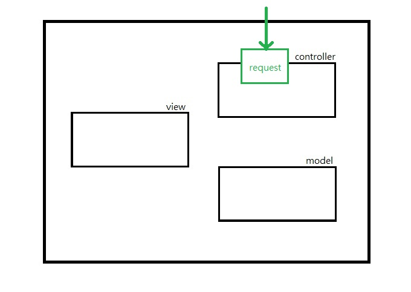
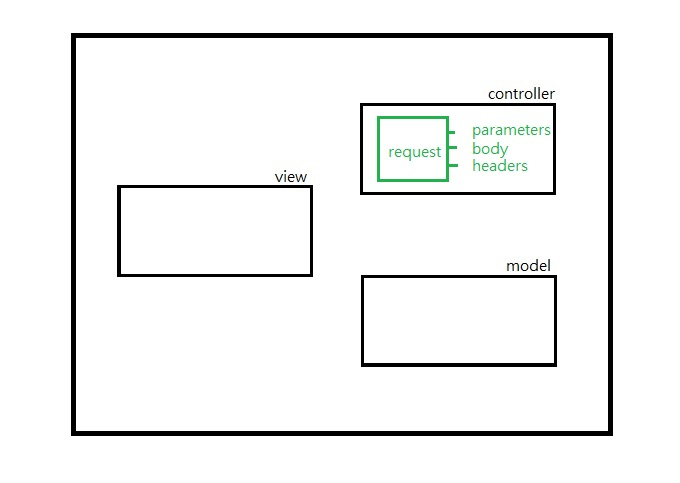
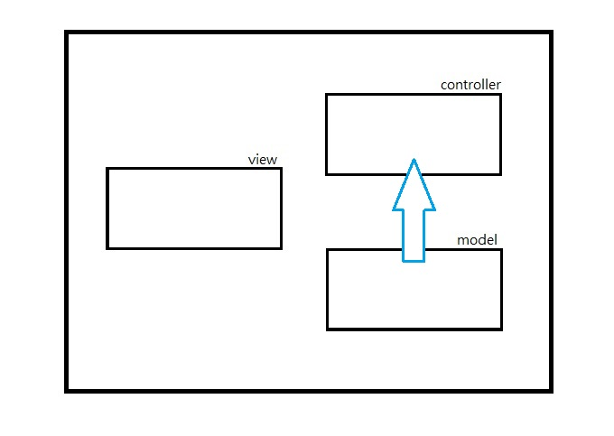
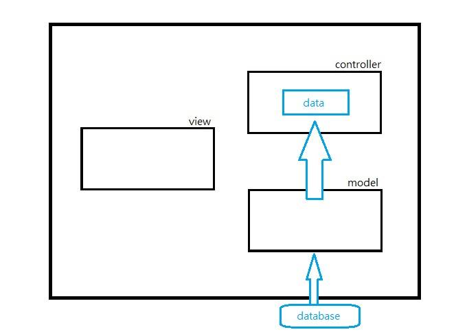
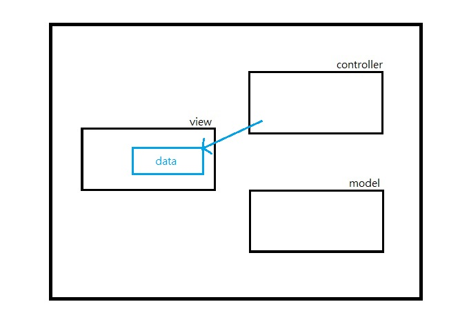
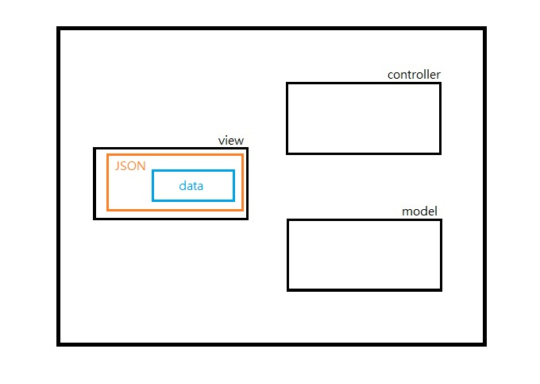
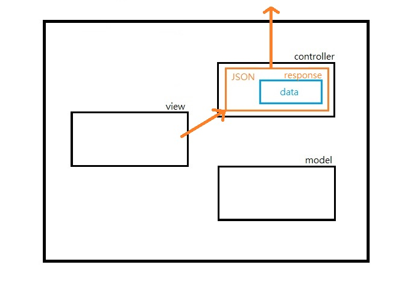

# MODEL-VIEW-CONTROLLER

this section is talking about Model, View, Controller architecture

## Table of Contents
- [MVC](#http)
- [Model](#model)
- [View](#view)
- [Controller](#controller)
- [Examples](#examples)
- [References](#references)

## MVC
MVC ( Model View Controller ) is a kind of software architecture.

It splits the **UI** and **business logic** into three parts:

- Model
- View
- Controller

There are many versions of MVC definition. And we are talking about the **Model2** here.

Model2 is a specific design for web application.

### MVC Procedure

Requests are passed to the controller.

The **controller** performs any logic necessary to obtain the correct content from model.

The **model** contains business logic to process data.

The controller pass processed data to **view** to render the response.

### MVC Frameworks
- Ruby on Rails
- Laravel
- Django

## Model
The model contains all business logic

### Model Examples
- Database Operations
- Action Policies

## View
The view renders the data

### View Examples
- Render HTML
- Render JSON

## Controller
The controller processes requests and passes data from specific model to specific view

## Examples
A client wants to get the specific user data :

1. request is passed to **controller**

    

- **controller** checks its request format

    

- **controller** calls **model** to get specific user data

    

- **model** connects to the database then reads data

    

- **controller** passes the data to **view**

    

- **view** render the user data in JSON

    

- response is passed to the client

    

## References
- https://en.wikipedia.org/wiki/Model%E2%80%93view%E2%80%93controller
- http://blog.turn.tw/?p=1539
